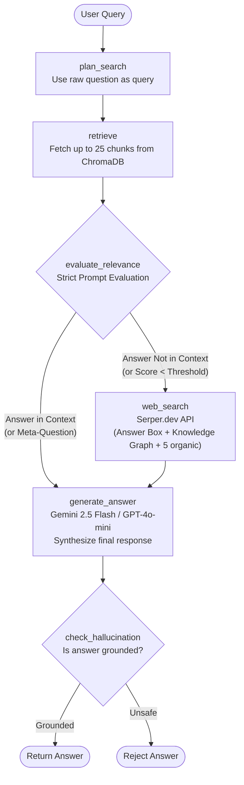

# Auto-Agentic RAG System

<p align="left">
  <a href="https://auto-agentic-rag.vercel.app/">
    
  </a>
  <a href="https://huggingface.co/spaces/Sunny9523/Agentic-Rag">
    
  </a>
  
</p>

🚀 [Try it Live → https://auto-agentic-rag.vercel.app](https://auto-agentic-rag.vercel.app/)

A modular, production-ready AutoDoc Retrieval-Augmented Generation (RAG) system built with a robust **FastAPI backend** and a visually stunning **React 19 + Vite 8 frontend**.

The system leverages a stateful **LangGraph** agent to dynamically retrieve up to 25 context chunks from your documents using **ChromaDB**. It evaluates semantic relevance in real-time, answers with **Gemini 2.5 Flash** (or OpenAI's `gpt-4o-mini` with Gemini fallbacks) when document context is explicitly clear, and intelligently falls back to live Google Search via **Serper.dev** when your uploaded documents lack the required information.

---

## ✦ Key Features

*   **Deep Context Retrieval**: Retrieves extended context windows (up to 25 chunks) to ensure the AI has strong knowledge from multiple uploaded documents before answering.
*   **Agentic Web Search Fallback**: If local documents lack the answer (determined by a strict LLM relevance grader or mathematical threshold), the agent searches the live web via the **Serper.dev** API, extracting the Answer Box, Knowledge Graph, and top 5 organic snippets to build deep context.
*   **Multi-file Local Ingestion**: Supports selecting multiple PDF, TXT, and CSV files in one upload. The backend uses `pypdf` and `pdfplumber` for robust PDF parsing and `pandas` for CSVs.
*   **Google Drive Ingestion**: Paste one or more Google Drive folder URLs, Google Doc/Sheet/Slides links, PDF links, or bare IDs. Supports OAuth 2.0 flow for reading private files shared with the authenticated account.
*   **Background Processing**: Ingestion (both local and Drive) runs in FastAPI `BackgroundTasks`, meaning HTTP responses return instantly, preventing timeouts during massive document uploads. The UI continuously polls job status.
*   **Dynamic Detail Scaling**: The agent's system prompt intelligently scales the length and detail of its answers based on instructions in your prompt (e.g., "tell me in detail" vs "briefly summarize").
*   **Session Isolation**: Each browser session gets a separate ChromaDB collection. "Clear previous session" wipes only that session's vector collection, ensuring true multi-user isolation.
*   **Advanced Premium UI**: Fully redesigned glassmorphic, dark-themed React frontend built with **Tailwind CSS v4**. Features dynamic particle mesh gradients, smooth hover micro-animations, Markdown rendering (`react-markdown` + `remark-gfm`), and an intuitive side-panel layout.
*   **Robust Error & Quota Handling**: Auto-heals corrupted ChromaDB, sanitizes metadata, handles empty files, and elegantly alerts the user if the Gemini API free-tier quota is exhausted.

---

## ⬡ Agentic Reasoning Flow (LangGraph State Machine)

Every query passes through a stateful LangGraph machine. The agent dynamically routes the query based on mathematical relevance scores and strict LLM evaluations.



### Graph State Breakdown
The `GraphState` passes vital information across nodes:
- `question`: Original user question.
- `session_id`: Unique session string for isolated document context.
- `documents`: List of context strings (from DB or Web).
- `relevance_scores`: Tracking mathematical confidence.
- `needs_web_search` / `used_web_search`: Flags indicating routing and tracking for the final output.

---

## ⊞ Project Structure

```text
AutoDoc RAG/
├── backend/
│   ├── app.py              # FastAPI server, CORS, BackgroundTasks, API endpoints
│   ├── agent_logic.py      # LangGraph state machine, LLM routing, Serper integration
│   ├── ingest.py           # File chunking & batch embedding pipeline (local & Drive)
│   ├── database.py         # ChromaDB operations wrapper, session isolation
│   ├── drive_loader.py     # Google Drive OAuth 2.0 integration & fetching
│   ├── config.py           # Pydantic settings loading (.env parsing)
│   ├── tests/              # Backend API contract tests
│   ├── requirements.txt    # Python dependencies
│   ├── .env                # Backend environment variables
│   ├── credentials.json    # Google OAuth credentials (required for Drive)
│   └── chroma_db/          # Auto-created local vector store
└── frontend/
    ├── src/
    │   ├── App.jsx         # Main React Chat/Upload Interface
    │   └── index.css       # Global styles and Tailwind configuration
    ├── .env.local          # Frontend environment variables
    ├── index.html
    ├── vite.config.js
    └── package.json        # Node dependencies (React 19, Tailwind 4)
```

---

## ⚡ Full Tech Stack

### Backend
*   **Framework**: `fastapi`, `uvicorn` (REST API & ASGI server)
*   **Validation & Config**: `pydantic`, `pydantic-settings`
*   **Agent & LLM**: `langchain`, `langgraph`, `langchain-google-genai` (Gemini 2.5 Flash), `langchain-openai` (Optional GPT-4o-mini fallback)
*   **Vector Storage**: `langchain-chroma`, `chromadb`
*   **Document Parsing**: `pypdf`, `pdfplumber` (PDFs), `pandas` (CSVs)
*   **External APIs**: `google-api-python-client`, `google-auth-oauthlib` (Google Drive), `langchain_community.utilities` (Google Serper)

### Frontend
*   **Framework**: React 19 (`react`, `react-dom`)
*   **Build Tool**: Vite 8 (`vite`)
*   **Styling**: Tailwind CSS v4 (`tailwindcss`, `@tailwindcss/vite`)
*   **Rendering**: `react-markdown`, `remark-gfm` (Markdown tables, lists, formatting)

---

## ⇄ API Endpoints

### `POST /api/ingest`
Uploads and ingests one or more local files into the vector store.
*   **Body:** `multipart/form-data` — `files`, `clear_previous` (bool), `session_id` (string)
*   **Response:** Returns a `job_id` immediately while parsing happens in the background.

### `GET /api/ingest/status/{job_id}`
Checks the status of a background local-file or Drive ingestion job.
*   **Response:** `{ "status": "processing|completed|failed", "kind": "local|drive", "files": [...], "completed": [...], "failed": [...] }`

### `POST /api/ingest/drive`
Ingests documents from one or more Google Drive folder/file URLs or IDs.
*   **Body:** `{ "folder_id": "...", "drive_links": ["<url>"], "clear_previous": true, "session_id": "..." }`
*   **Response:** Returns a `job_id`.

### `POST /api/query`
Sends a question to the LangGraph agent and returns an answer.
*   **Body:** `{ "question": "What is the refund policy?", "session_id": "..." }`
*   **Response:** `{ "answer": "..." }`

### `GET /api/health`
Health-check endpoint.

---

## ⚙ Environment Variables

### Backend (`backend/.env`)
| Variable | Description | Default |
| :--- | :--- | :--- |
| `GEMINI_API_KEY` | Your Google Gemini API Key (Required). | - |
| `OPENAI_API_KEY` | Optional OpenAI API Key (Uses `gpt-4o-mini` if provided, falls back to Gemini). | - |
| `SERPER_API_KEY` | Your Serper.dev API Key for Agentic Web Search. | - |
| `API_KEY` | Security key for all endpoints. Leave blank for local dev. | - |
| `MIN_RELEVANCE_SCORE`| Minimum Chroma DB similarity score before forcing web search. | `0.15` |
| `ALLOWED_ORIGINS` | CORS allowed origins (comma separated). | `*` |
| `CHROMA_DB_DIR` | Local directory to store vector databases. | `./chroma_db` |

### Frontend (`frontend/.env.local`)
| Variable | Description |
| :--- | :--- |
| `VITE_API_URL` | Base URL of your backend (e.g., `http://localhost:8000`). |
| `VITE_API_KEY` | Must match the `API_KEY` from the backend to authorize requests. |

---

## ▶ How to Run Locally

### Prerequisites
*   Python 3.10+
*   Node.js 18+
*   Google Gemini API Key (Get one free at [aistudio.google.com](https://aistudio.google.com/))
*   Serper API Key (Get one free at [serper.dev](https://serper.dev/))

### 1. Backend Setup

```bash
cd backend
python -m venv venv
source venv/bin/activate
pip install -r requirements.txt
```

Create a `.env` file in `backend/` and configure your API keys.

Start the FastAPI server:
```bash
uvicorn app:app --reload --port 8000
```

### 2. Frontend Setup

```bash
cd frontend
npm install
npm run dev
```

Create `frontend/.env.local` and set `VITE_API_URL=http://localhost:8000`.

Open `http://localhost:5173` in your browser.

---

## ☁ Google Drive Configuration

To use the Google Drive ingestion feature:
1. Go to the Google Cloud Console and create a project.
2. Enable the Google Drive API.
3. Go to APIs & Services -> Credentials -> Create OAuth 2.0 Client ID (Desktop App).
4. Download the JSON file, rename it to `credentials.json`, and place it in your `backend/` directory.

On your first Drive ingestion, a browser window will open asking you to sign in and grant read permissions. This will generate a `token.json` file automatically, and you will not be asked to sign in again.

---

## ▲ Cloud Deployment

### Deploy Backend to Hugging Face
1. Create a **Blank Docker Space** on huggingface.co/spaces.
2. Push your repository to the Space using Git. Hugging Face will automatically detect the `Dockerfile` and build your backend.
3. In your Space Settings -> Variables and secrets, add your `GEMINI_API_KEY`, `SERPER_API_KEY`, and a strong `API_KEY` password.

### Deploy Frontend to Vercel
1. Import your GitHub repository into Vercel.
2. Set the Root Directory to `frontend/`.
3. Add the Environment Variables:
   *   `VITE_API_URL`: Your Hugging Face Space URL.
   *   `VITE_API_KEY`: The exact same password you set in Hugging Face.

---
Built by Sunny Kant Kumar.
