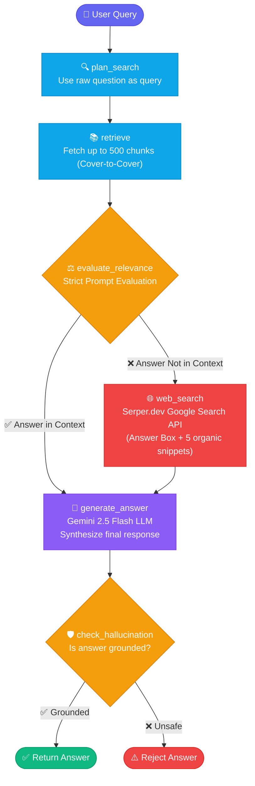

# 🤖 Auto-Agentic RAG System
---

[](https://auto-agentic-rag.vercel.app/)
[](https://sunny9523-agentic-rag.hf.space)
[](https://auto-agentic-rag.vercel.app/)

> 🚀 **[Try it Live → https://auto-agentic-rag.vercel.app](https://auto-agentic-rag.vercel.app/)**

A modular, production-ready **AutoDoc Retrieval-Augmented Generation (RAG) system** built with a **FastAPI** backend and a **React + Vite** frontend. 

The system leverages a stateful **LangGraph** agent to perform "Cover-to-Cover" reading of your documents using ChromaDB. It evaluates semantic relevance in real-time, answers with Gemini when document context is explicitly clear, and intelligently falls back to live Google Search via Serper.dev when your uploaded documents lack the required information. 

---

## 🌟 Key Features

| Feature | Description |
|---|---|
| **Cover-to-Cover Processing** | Retrieves massive context windows (up to 500 chunks) to ensure the AI reads multiple uploaded documents in their entirety before answering. |
| **Multi-file Local Ingestion** | Supports selecting multiple PDF, TXT, and CSV files in one upload. Chunks, embeds, and stores in ChromaDB automatically. |
| **Ingestion Status Tracking** | Local uploads and Drive ingestion run in the background and the UI polls job status until ingestion completes. |
| **Google Drive Ingestion** | Paste one or more Google Drive folder URLs, Google Doc/Sheet/Slides links, PDF links, or bare IDs. Public links and files shared with the authenticated account can be ingested. |
| **Agentic Web Search** | If documents don't contain the answer, the agent searches the live web via Serper.dev (Google Search API), extracting multiple organic snippets to build deep context. |
| **Dynamic Detail Scaling** | The agent's system prompt intelligently scales the length and detail of its answers based on instructions in your prompt (e.g., "tell me in detail" vs "briefly summarize"). |
| **Score-based Relevance Gate** | Uses Chroma relevance scores instead of an extra LLM relevance-grading call, reducing Gemini quota usage. |
| **Session Isolation** | Each browser session gets a separate ChromaDB collection. "Clear previous session" wipes only that session's collection. |
| **Optional API-Key Auth** | Set `API_KEY` on the backend and `VITE_API_KEY` on the frontend to protect API endpoints before deployment. |
| **Batch Embedding** | Chunks are embedded 10 at a time (not one-by-one), making ingestion ~10x faster. |
| **Backend Contract Tests** | Includes `unittest` coverage for API-key auth, Drive link splitting, and Drive ingestion job status. |
| **Advanced Premium UI** | Fully redesigned glassmorphic, dark-themed React frontend built with Tailwind CSS v4. Features dynamic particle mesh gradients, smooth hover micro-animations, and an intuitive side-panel layout. |
| **Robust Error Handling** | Auto-heals corrupted ChromaDB, sanitizes metadata, handles empty files, and provides clear error messages. |

---

## 🧠 Agentic Reasoning Flow (LangGraph State Machine)

Every query passes through a stateful LangGraph machine. The agent dynamically routes the query based on mathematical relevance scores and strict LLM evaluations.



---

## 📁 Project Structure

```text
AutoDoc RAG/
├── backend/
│   ├── app.py              # FastAPI server (API endpoints)
│   ├── agent_logic.py      # LangGraph state machine (Routing & LLM)
│   ├── ingest.py           # File chunking & embedding pipeline
│   ├── database.py         # ChromaDB operations wrapper
│   ├── drive_loader.py     # Google Drive OAuth 2.0 integration
│   ├── config.py           # Pydantic settings loading
│   ├── tests/              # Backend API contract tests
│   ├── requirements.txt    # Python dependencies
│   ├── .env                # Backend environment variables
│   ├── credentials.json    # Google OAuth credentials (required for Drive)
│   └── chroma_db/          # Auto-created local vector store
└── frontend/
    ├── src/
    │   ├── App.jsx         # Main React Chat/Upload Interface
    │   └── index.css       # Global styles and Tailwind configuration
    ├── .env.local          # Frontend environment variables
    ├── index.html
    ├── vite.config.js
    └── package.json        # Node dependencies
```

---

## ⚙️ Full Tech Stack

### Backend
| Package | Role |
|---|---|
| `fastapi`, `uvicorn` | REST API framework and ASGI server |
| `pydantic`, `pydantic-settings` | Data validation and `.env` config loading |
| `langchain`, `langgraph` | Core orchestration and state machine |
| `langchain-google-genai` | Gemini 2.5 Flash LLM + Embeddings |
| `langchain-chroma`, `chromadb` | Vector Storage integration |
| `pypdf`, `pdfplumber`, `pandas` | Document parsing (PDFs, CSVs) |
| `google-api-python-client` | Google Drive API v3 |
| `google-auth-oauthlib` | OAuth 2.0 flow authentication |

### Frontend
| Package | Role |
|---|---|
| `react`, `react-dom` | UI component library (React 19) |
| `vite` | Dev server and bundler (Vite 8) |
| `tailwindcss` | Utility-first CSS framework (v4) |
| `react-markdown`, `remark-gfm` | Markdown rendering for AI responses |

---

## 🔌 API Endpoints

### `POST /api/ingest`
Uploads and ingests one or more local files into the vector store.
- **Body:** `multipart/form-data` — `files`, `clear_previous` (bool), `session_id` (string)
- **Response:** `{ "job_id": "...", "files": ["file1.pdf"], "message": "Ingesting 1 file: file1.pdf" }`

### `GET /api/ingest/status/{job_id}`
Checks the status of a background local-file or Drive ingestion job.
- **Response:** `{ "status": "processing|completed|failed", "kind": "local|drive", "session_id": "...", "files": [...], "completed": [...], "failed": [...] }`

### `POST /api/ingest/drive`
Ingests documents from one or more Google Drive folder/file URLs or IDs.
- **Body:** `{ "drive_links": ["<url-or-id-1>"], "clear_previous": true, "session_id": "..." }`
- **Response:** `{ "job_id": "...", "files": [...], "message": "Ingesting Google Drive links." }`

### `POST /api/query`
Sends a question to the LangGraph agent and returns an answer.
- **Body:** `{ "question": "What is the refund policy?", "session_id": "..." }`
- **Response:** `{ "answer": "According to the document..." }`

---

## 🚀 How to Run Locally

### Prerequisites
- Python 3.10+
- Node.js 18+
- [Google Gemini API Key](https://aistudio.google.com/)

### 1. Backend Setup

```bash
cd backend
python -m venv venv
source venv/bin/activate
pip install -r requirements.txt
```

Create a `.env` file in `backend/`:
```env
GEMINI_API_KEY=your_gemini_api_key_here
SERPER_API_KEY=your_serper_api_key_here
API_KEY=change_this_before_deploying
MIN_RELEVANCE_SCORE=0.50
ALLOWED_ORIGINS=http://localhost:5173,http://127.0.0.1:5173
CHROMA_DB_DIR=./chroma_db
```
*(Leave `API_KEY` empty to disable security for local testing).*

Start the FastAPI server:
```bash
uvicorn app:app --reload --port 8000
```

### 2. Frontend Setup

```bash
cd frontend
npm install
npm run dev
```

Create `frontend/.env.local`:
```env
VITE_API_URL=http://localhost:8000
VITE_API_KEY=change_this_before_deploying
```

Open [http://localhost:5173](http://localhost:5173) in your browser!

---

## 🔗 Google Drive Configuration

To use the Google Drive ingestion feature:
1. Go to the **Google Cloud Console** and create a project.
2. Enable the **Google Drive API**.
3. Go to **APIs & Services → Credentials** → Create **OAuth 2.0 Client ID (Desktop App)**.
4. Download the JSON file, rename it to `credentials.json`, and place it in your `backend/` directory.

On your first Drive ingestion, a browser window will open asking you to sign in and grant read permissions. This will generate a `token.json` file automatically, and you will not be asked to sign in again.

---

## ☁️ Cloud Deployment (100% Free)

### Deploy Backend to Hugging Face
1. Create a **Blank Docker Space** on [huggingface.co/spaces](https://huggingface.co/spaces).
2. Push your repository to the Space using Git. Hugging Face will automatically detect the `Dockerfile` and build your backend.
3. In your Space **Settings → Variables and secrets**, add your `GEMINI_API_KEY`, `SERPER_API_KEY`, and a strong `API_KEY` password.

### Deploy Frontend to Vercel
1. Import your GitHub repository into Vercel.
2. Set the **Root Directory** to `frontend/`.
3. Add the Environment Variables:
   - `VITE_API_URL`: Your Hugging Face Space URL.
   - `VITE_API_KEY`: The exact same password you set in Hugging Face.

---

<div align="center">
  <p>Built with curiosity by <b>Sunny Kant Kumar</b>. 🤖✨</p>
</div>
