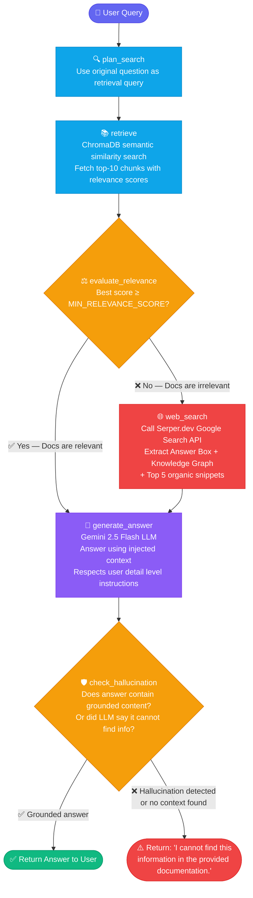

# 🤖 AutoDoc RAG System
---


[](https://auto-agentic-rag.vercel.app/)
[](https://sunny9523-agentic-rag.hf.space)
[](https://auto-agentic-rag.vercel.app/)

> 🚀 **[Try it Live → https://auto-agentic-rag.vercel.app](https://auto-agentic-rag.vercel.app/)**

A modular, production-ready **AutoDoc Retrieval-Augmented Generation (RAG) system** built with a **FastAPI** backend and a **React + Vite** frontend. The system uses a stateful **LangGraph** agent to retrieve relevant document chunks from ChromaDB, gate results by similarity score, answer with Gemini when document context is strong enough, and fall back to live Google Search via Serper when the uploaded documents do not contain the answer. It supports ingestion from local file uploads as well as directly from **Google Drive**.

---

## 🌟 Key Features

| Feature | Description |
|---|---|
| **Multi-file Local Ingestion** | Supports selecting multiple PDF, TXT, and CSV files in one upload. Chunks, embeds, and stores in ChromaDB automatically. |
| **Ingestion Status Tracking** | Local uploads and Drive ingestion run in the background and the UI polls job status until ingestion completes. |
| **Google Drive Ingestion** | Paste one or more Google Drive folder URLs, Google Doc/Sheet/Slides links, PDF links, or bare IDs. Public links and files shared with the authenticated account can be ingested. |
| **Agentic Web Search** | If documents don't contain the answer, the agent searches the live web via Serper.dev (Google Search API), extracting multiple organic snippets to build deep context. |
| **Dynamic Detail Scaling** | The agent's system prompt intelligently scales the length and detail of its answers based on instructions in your prompt (e.g., "tell me in detail" vs "briefly summarize"). |
| **Score-based Relevance Gate** | Uses Chroma relevance scores instead of an extra LLM relevance-grading call, reducing Gemini quota usage. |
| **Session Isolation** | Each browser session gets a separate ChromaDB collection. "Clear previous session" wipes only that session's collection. |
| **Optional API-Key Auth** | Set `API_KEY` on the backend and `VITE_API_KEY` on the frontend to protect API endpoints before deployment. |
| **Batch Embedding** | Chunks are embedded 10 at a time (not one-by-one), making ingestion ~10x faster. |
| **Backend Contract Tests** | Includes `unittest` coverage for API-key auth, Drive link splitting, and Drive ingestion job status. |
| **Premium UI** | Glassmorphic, dark-themed React frontend with smooth animations and an "Agent is thinking..." indicator. |
| **Robust Error Handling** | Auto-heals corrupted ChromaDB, sanitizes metadata, handles empty files, and provides clear error messages. |

---

## 🧠 Agentic Reasoning Flow (LangGraph State Machine)

Every query goes through a stateful LangGraph graph. The agent uses **score-based gating** to avoid unnecessary LLM calls, and **hallucination checking** to ensure answers are grounded in real context.



**Key Design Decisions in this Flow:**
- **`plan_search`** → Passes the user's raw question directly to ChromaDB (no query rewriting needed at this stage)
- **`retrieve`** → Fetches **top-10 chunks** (k=10) with relevance scores so the LLM has rich context for detailed answers
- **`evaluate_relevance`** → Uses ChromaDB's mathematical similarity score as a **free relevance gate** — avoids a costly extra LLM grading call
- **`web_search`** → Hits Serper.dev Google API and extracts **Answer Box + Knowledge Graph + 5 organic snippets** for deep context
- **`generate_answer`** → Single Gemini LLM call; dynamically scales detail level based on user's prompt instructions
- **`check_hallucination`** → Guards the final output; if the LLM could not find relevant content it returns the standard "cannot find" message instead of a hallucinated answer


---

## 📁 Project Structure

```
AutoDoc RAG/
├── backend/
│   ├── app.py              # FastAPI server — defines all API endpoints
│   ├── agent_logic.py      # LangGraph state machine (the "brain")
│   ├── ingest.py           # File loading, chunking, batch embedding pipeline
│   ├── database.py         # ChromaDB wrapper (add, search, clear)
│   ├── drive_loader.py     # Google Drive API integration (OAuth 2.0)
│   ├── config.py           # Pydantic settings — reads from .env
│   ├── tests/              # Backend API contract tests
│   ├── requirements.txt    # All Python dependencies
│   ├── .env.example        # Example backend environment variables
│   ├── credentials.json    # Google OAuth credentials (you provide this)
│   └── chroma_db/          # Auto-created local vector store
└── frontend/
    ├── src/
    │   ├── App.jsx          # Single-page React app (chat + upload + Drive)
    │   └── index.css        # Glassmorphic styles, animations
    ├── index.html
    ├── vite.config.js
    └── package.json
```

---

## ⚙️ Full Tech Stack

### Backend
| Package | Role |
|---|---|
| `fastapi` | REST API framework |
| `uvicorn` | ASGI server to run FastAPI |
| `python-multipart` | Multipart file upload parsing |
| `pydantic` + `pydantic-settings` | Data validation and `.env` config loading |
| `langchain` | Core orchestration framework |
| `langgraph` | Stateful agent state machine |
| `langchain-google-genai` | Gemini LLM + Gemini Embedding API |
| `langchain-chroma` | ChromaDB integration |
| `langchain-community` | Document loaders, Google Serper search tool |
| `pypdf` | PDF text extraction |
| `pdfplumber` | Enhanced PDF extraction |
| `pandas` | CSV handling |
| `google-api-python-client` | Google Drive API v3 |
| `google-auth-oauthlib` | OAuth 2.0 flow |
| `google-auth-httplib2` | HTTP transport for Google Auth |

### Frontend
| Package | Role |
|---|---|
| `react` 19 | UI component library |
| `react-dom` | React DOM renderer |
| `vite` 8 | Dev server and production bundler |
| `tailwindcss` v4 | Utility-first CSS framework |
| `@vitejs/plugin-react` | React fast-refresh plugin |
| `eslint` | Code linting |

### AI / Cloud
| Service | Model / Usage |
|---|---|
| **Google Gemini** | `gemini-2.5-flash` — LLM for final answer generation |
| **Google Gemini Embeddings** | `models/gemini-embedding-2` — Text → vector conversion |
| **Serper.dev (Google Search)** | High-quality live web search fallback via API |
| **Google Drive API v3** | OAuth-authenticated folder/file reading |

---

## 🔌 API Endpoints

### `POST /api/ingest`
Uploads and ingests one or more local files into the vector store. Ingestion runs in the background so large files do not block the HTTP request.
- **Auth:** optional `X-API-Key` header when `API_KEY` is configured.
- **Body:** `multipart/form-data` — `files` (one or more PDF/TXT/CSV files), `clear_previous` (bool), `session_id` (string)
- **Response:** `{ "job_id": "...", "files": ["file1.pdf"], "message": "Ingesting 1 file: file1.pdf" }`

### `GET /api/ingest/status/{job_id}`
Checks the status of a background local-file or Drive ingestion job.
- **Auth:** optional `X-API-Key` header when `API_KEY` is configured.
- **Response:** `{ "status": "processing|completed|failed", "kind": "local|drive", "session_id": "...", "files": [...], "completed": [...], "failed": [...] }`

### `POST /api/ingest/drive`
Ingests documents from one or more Google Drive folder/file URLs or IDs.
- **Auth:** optional `X-API-Key` header when `API_KEY` is configured.
- **Body:** `{ "drive_links": ["<url-or-id-1>", "<url-or-id-2>"], "clear_previous": true, "session_id": "..." }`
- **Response:** `{ "job_id": "...", "files": [...], "message": "Ingesting 2 Google Drive links." }`

### `POST /api/query`
Sends a question to the LangGraph agent and returns an answer.
- **Auth:** optional `X-API-Key` header when `API_KEY` is configured.
- **Body:** `{ "question": "What is the refund policy?", "session_id": "..." }`
- **Response:** `{ "answer": "According to the document..." }`

Swagger UI: `http://localhost:8000/docs`

---

## 🚀 How to Run Locally

### Prerequisites
- Python 3.10+
- Node.js 18+
- A Google Gemini API key ([get one free here](https://aistudio.google.com/))

### 1. Backend Setup

```bash
cd backend
python -m venv venv
source venv/bin/activate        # On Windows: venv\Scripts\activate
pip install -r requirements.txt
```

Create a `.env` file in `backend/`:
```env
GEMINI_API_KEY=your_gemini_api_key_here
SERPER_API_KEY=your_serper_api_key_here
API_KEY=change_this_before_deploying
MIN_RELEVANCE_SCORE=0.50
ALLOWED_ORIGINS=http://localhost:5173
CHROMA_DB_DIR=./chroma_db
```

Start the server:
```bash
uvicorn app:app --reload --port 8000
```

### 2. Frontend Setup

```bash
cd frontend
npm install
npm run dev
```

Create `frontend/.env.local` for local development:
```env
VITE_API_URL=http://127.0.0.1:8000
VITE_API_KEY=change_this_before_deploying
```

If `API_KEY` is left empty in the backend, API-key auth is disabled. For production, set both `API_KEY` and `VITE_API_KEY` to the same strong secret.

Open: `http://localhost:5173`

---

## ✅ Tests

Run backend contract tests:

```bash
cd backend
source venv/bin/activate
python -m unittest discover -s tests
```

Run frontend production build check:

```bash
cd frontend
npm run build
```

---

## 🔗 Google Drive Integration Setup

1. Go to [Google Cloud Console](https://console.cloud.google.com/) and create a project.
2. Enable the **Google Drive API**.
3. Go to **APIs & Services → Credentials** → Create **OAuth 2.0 Client ID** → Desktop App.
4. Download JSON, rename to `credentials.json`, and move to `backend/`.

The first Drive ingestion authenticates once and writes `backend/token.json`. After that, the same token is reused.

Drive links work when the authenticated Google account can read them:
- Files/folders owned by that account.
- Files/folders shared with that account.
- Public files/folders where **Anyone with the link can view** is enabled.

Unsupported or inaccessible files are skipped or reported as errors. Images and videos are not OCR'd by default.

---

## ⚙️ Configuration

### Backend (`backend/.env`)

| Variable | Default | Description |
|---|---|---|
| `GEMINI_API_KEY` | `""` | Your Google Gemini API key |
| `API_KEY` | `""` | Optional API key. When set, protected endpoints require `X-API-Key`. |
| `CHROMA_DB_DIR` | `./chroma_db` | Local ChromaDB storage path |
| `MIN_RELEVANCE_SCORE` | `0.50` | Minimum Chroma relevance score needed to answer from uploaded documents. Lower trusts docs more; higher routes to web search more often. |
| `ALLOWED_ORIGINS` | `*` | Allowed CORS origins |

### Frontend (`frontend/.env.local`)

| Variable | Default | Description |
|---|---|---|
| `VITE_API_URL` | `http://127.0.0.1:8000` | Backend API base URL. |
| `VITE_API_KEY` | `""` | API key sent to the backend as `X-API-Key` when backend auth is enabled. |

---

## ☁️ Production Deployment (100% Free)

| Layer | Platform | Notes |
|---|---|---|
| **Frontend** | [Vercel](https://vercel.com) | Set root directory to `frontend/`, add env vars |
| **Backend** | [Hugging Face Spaces](https://huggingface.co/spaces) | Docker space, add secrets in Space settings |
| **Vector DB** | ChromaDB inside Docker | Bundled with backend |
| **LLM** | Google Gemini API | Free tier (15 req/min) |

### 🛠️ Step-by-Step Deployment

#### 1. Push to GitHub

```bash
git add .
git commit -m "your commit message"
git push origin main
```

#### 2. Deploy Backend to Hugging Face

Create a **Blank Docker Space** on [huggingface.co/spaces](https://huggingface.co/spaces), then push your code:

```bash
# First time — add the Hugging Face remote
git remote add huggingface https://<your-hf-username>:<your-hf-write-token>@huggingface.co/spaces/<your-hf-username>/<your-space-name>

# Push to Hugging Face (triggers automatic Docker build & deploy)
git push huggingface main
```

> Every time you update the backend, just run `git push huggingface main` again. Hugging Face rebuilds and restarts automatically (takes ~2–5 minutes).

#### 3. Set Hugging Face Secrets

Go to your Space → **Settings → Variables and secrets** and add:

| Secret | Value |
|---|---|
| `GEMINI_API_KEY` | Your Google Gemini API key |
| `API_KEY` | A strong secret key |
| `ALLOWED_ORIGINS` | Your Vercel frontend URL (e.g. `https://your-app.vercel.app`) |

#### 4. Deploy Frontend to Vercel

Import the GitHub repo into [vercel.com](https://vercel.com):
- Set **Root Directory** to `frontend/`
- Add environment variables:

| Variable | Value |
|---|---|
| `VITE_API_URL` | Your Hugging Face Space URL (e.g. `https://your-username-your-space.hf.space`) |
| `VITE_API_KEY` | Same value as `API_KEY` set in Hugging Face secrets |

#### 5. Lock Down CORS

Set `ALLOWED_ORIGINS` in your Hugging Face secrets to your exact Vercel URL:
```
ALLOWED_ORIGINS=https://your-app.vercel.app
```

> **Note:** Do not use `*` wildcard with API key auth — browsers will block requests.

---

## 📈 Limitations & Future Improvements

| Limitation | Suggested Fix |
|---|---|
| No conversation memory | Add chat history to `GraphState` for multi-turn context. |
| ChromaDB is still local/self-hosted | Migrate to Pinecone, Weaviate, Qdrant Cloud, or Chroma Cloud for managed vector storage. |
| API-key auth is not full user login | Add Clerk, Auth0, Firebase Auth, or Supabase Auth for real user accounts. |
| Session isolation is browser-based | Map authenticated user IDs to collections after adding full login. |
| Requires API Key for web search | Serper.dev provides 2,500 free queries, but it is not completely free forever like DuckDuckGo. |
| No OCR for images/videos | Add OCR and media extraction for scanned PDFs, images, or video transcripts. |

---

## 👤 Author

**Sunny Kant Kumar**

Built with curiosity, caffeine, and a love for books. 📖✨
